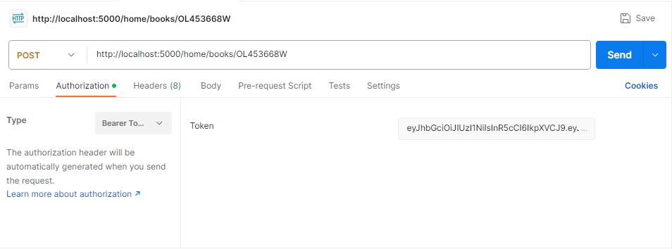

# BookGenerator

## About the Project
## Features
Prior to working with the application ensure you have downloaded all files properly:
- Ensure that the .env file is configured properly
- Run 'npm install' on book-api
- Run 'npm install' on book-generator
- Run 'npm run dev' to start the application

## Users Routes
- Register User
- Login User
- User Profile Information

### Register User [POST]
#### localhost:5000/home/users/

  
  

### User Log-in [POST]
#### localhost:5000/home/users/login

  
  

### User Profile [GET]
#### localhost:5000/home/users/me

  
  

## Books Routes
- Generate New Book
- Get all books in Database
- Save book to database
- Update book in database
- Delete book in database

### Generate New Book [GET]
#### localhost:5000/home/books/newBook

  
  

### Get All Books [GET]
#### localhost:5000/home/books/

  
  
  

### Save Book [POST]
#### localhost:5000/home/books/:id

  
  

### Update Book [PUT]
#### localhost:5000/home/books/:id

  
  

### Delete Book [DELETE]
#### localhost:5000/home/books/:id

  
  
  

## Built Using
- JavaScript
- NodeJS
- ExpressJS
- MongoDB
- VSCode
- book-api (personally created using the OpenLibrary API)

